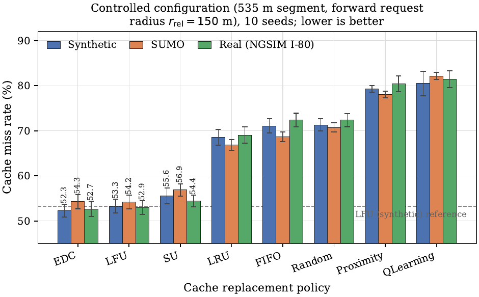
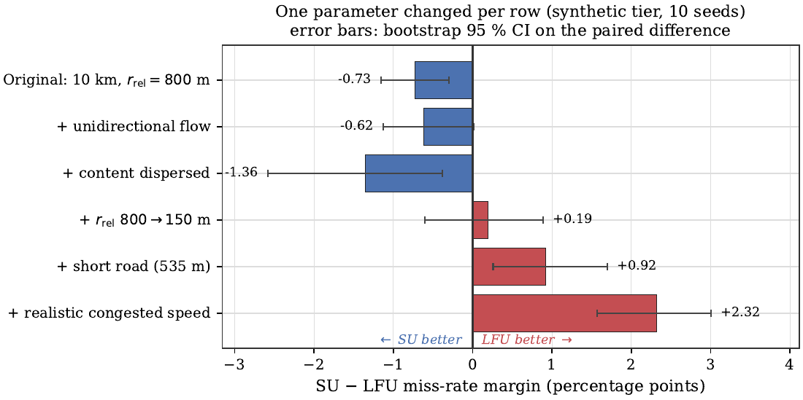
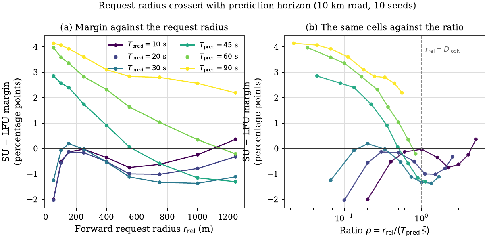
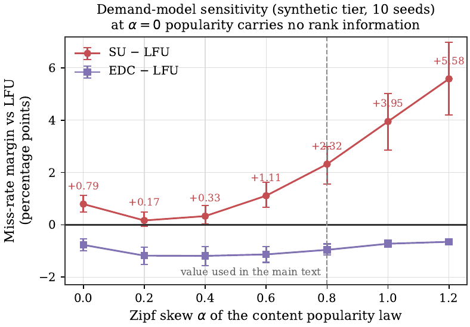
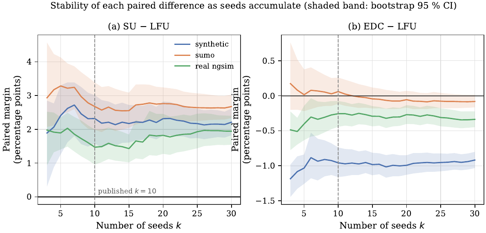

# CrossTrafficCaching

**A controlled evaluation harness for vehicular edge caching, and the artifact for the paper _Request Radius Rather Than Mobility Model Fidelity Controls the Reported Gains of Spatial Urgency Policies in Vehicular Edge Caching_.**

[](https://github.com/adeliusa486/CrossTrafficCaching/actions/workflows/ci.yml)
[](https://python.org)
[](LICENSE)
[](https://github.com/psf/black)

---

## Contents

- [What this repository is](#what-this-repository-is)
- [Summary of findings](#summary-of-findings)
- [Figures](#figures)
- [Installation](#installation)
- [Quick start](#quick-start)
- [Reproducing the paper](#reproducing-the-paper)
- [Verifying the reported numbers](#verifying-the-reported-numbers)
- [Cache policies](#cache-policies)
- [Repository structure](#repository-structure)
- [Data sources](#data-sources)
- [Configuration](#configuration)
- [Testing](#testing)
- [Limitations](#limitations)
- [Citation](#citation)
- [License](#license)

---

## What this repository is

This is a replay harness for comparing cache replacement policies at a vehicular
roadside unit, together with the eight policy implementations and the complete
per-seed results behind every table and figure in the paper.

The harness exists to answer a specific methodological question. Mobility-aware
caching policies are regularly reported to outperform classical baselines, but
those evaluations vary the mobility model and the scenario configuration at the
same time, so the source of a reported gain cannot be identified afterwards.
This harness holds the demand model and the per-seed request streams fixed while
varying the traffic source and the scenario independently, which makes the two
factors separable.

Three traffic sources are supported through a common replay interface:

| Tier | Source | Description |
| --- | --- | --- |
| 1 | Synthetic | Platoon-based kinematic model, the style common in this literature |
| 2 | SUMO | Microscopic simulation, Krauss car-following, floating-car output |
| 3 | Real | Recorded NGSIM I-80 and US-101 vehicle trajectories, replayed at 1 Hz |

Any policy implementing the `BaseCache` interface can be run against any tier
under an identical demand model.

---

## Summary of findings

All values are mean cache miss rate over independent seeds, under the controlled
configuration (535 m segment, forward request radius 150 m, 200-item catalog,
20-item cache). Positive margin means the policy is **worse** than LFU.

| Finding | Evidence |
| --- | --- |
| Policy rankings are largely stable across traffic sources | Kendall tau_b = 0.905 to 1.0 between tiers |
| The spatial-urgency policy loses to sliding-window LFU on all three tiers | +1.47 to +2.67 pp, all p = 0.014 |
| The margin depends on the request radius relative to the policy's lookahead | Minimum at exactly r_rel = D_look = 750 m |
| Cache capacity and catalog size also reverse the sign | SU wins at 2.5 % cache ratio, loses at 10 % and above |
| The result is not an artifact of the Zipf demand model | SU still loses at alpha = 0, where popularity carries no rank information |
| The urgency signal is informative but weaker than popularity | Spearman rho = 0.54 versus 0.87 on recorded traffic |
| EDC tracks LFU without a tuned weight, at near-LFU cost | 1.04x LFU cost per request |

The paper's argument is that the sign of a reported spatial gain is determined by
at least three scenario parameters an author chooses freely, none of which is a
property of the traffic.

---

## Figures

Regenerate all figures with `python scripts/make_paper_figures.py`. Each reads
directly from the stored per-seed JSON files, so no number is hard-coded.

**Miss rate by policy and mobility tier**



**Configuration ablation: the margin as one parameter changes at a time**



**Request radius crossed with prediction horizon**



**Demand-model sensitivity: margin against the Zipf skew**



**Seed stability: each paired difference as seeds accumulate from 3 to 30**



---

## Installation

Python 3.10 or newer is required. SUMO is required only for the Tier 2
experiments; Tiers 1 and 3 run without it.

### Linux and macOS

```bash
git clone https://github.com/adeliusa486/CrossTrafficCaching.git
cd CrossTrafficCaching

python3 -m venv .venv
source .venv/bin/activate

pip install -e .
```

### Windows

```powershell
git clone https://github.com/adeliusa486/CrossTrafficCaching.git
cd CrossTrafficCaching

python -m venv .venv
.venv\Scripts\activate

pip install -e .
```

### Exact versions used for the paper

To reproduce the published numbers rather than merely run the code, install the
pinned dependency set:

```bash
pip install -r requirements-lock.txt
```

### Optional: SUMO for Tier 2

Tier 2 requires [Eclipse SUMO](https://eclipse.dev/sumo/) 1.27 or compatible.
The scripts expect the binary at the path set in each Tier 2 runner; edit
`SUMO_BIN` at the top of `scripts/run_matched_tiers.py` and
`scripts/run_seed_extension.py` if your installation differs.

---

## Quick start

Run one policy on one scenario and print its miss rate. This takes a few seconds
and confirms the installation works.

```python
from trajectorycache.cache import build_cache
from trajectorycache.evaluation.metrics import compute_metrics
from trajectorycache.simulation.runner import SimulationConfig, SimulationRunner

cfg = SimulationConfig(
    road_length=535.0,          # controlled segment length (m)
    active_zone_length=535.0,   # content spread over the whole segment
    r_rel=150.0,                # forward request radius (m)
    n_vehicles=130,
    mean_speed=7.7,             # m/s, matching congested NGSIM I-80
    speed_std=3.0,
    platoon_size=10,
    unidirectional=True,
    n_items=200,
    cache_capacity=20,
    zipf_alpha=0.8,
    n_steps=600,
    warmup_steps=150,
    seed=84810,
)

for policy, kwargs in [
    ("lfu", {"pop_window": 300.0}),
    ("trajectory", {"urgency_weight": 0.2}),   # SU
    ("expected_demand", {"r_req": 150.0}),     # EDC
]:
    cache = build_cache(policy, cfg.cache_capacity, **kwargs)
    result = SimulationRunner(cache, cfg).run()
    print(f"{policy:18s} miss rate = {compute_metrics(result).miss_rate * 100:.2f} %")
```

Expected output. These are the seed 84810 entries of the synthetic column of
Table 4 in the paper, and they match the stored per-seed values
(`53.8339`, `54.1400`, `52.3906`) exactly:

```text
lfu                miss rate = 53.83 %
trajectory         miss rate = 54.14 %
expected_demand    miss rate = 52.39 %
```

---

## Reproducing the paper

Every table and figure maps to exactly one script and one stored result file.
Runtimes below were measured on a 20-core workstation with the worker pool size
set in each script.

| Paper item | Script | Output file | Runtime |
| --- | --- | --- | --- |
| Table 4, Tiers 1 and 2 | `run_matched_tiers.py` | `matched_tiers_535m.json` | ~15 min |
| Table 4, Tier 3 | `run_real_ngsim.py` | `real_ngsim_i80.json` | ~5 min |
| Table 5, Figure 3 | `run_config_ablation.py` | `config_ablation.json` | ~20 min |
| Table 6, Figure 4 | `run_radius_continuum.py` | `radius_continuum.json` | ~63 min |
| Table 7, Figure 5 | `run_freeflow.py` | `real_freeflow.json` | ~10 min |
| Table 8 (Section 6.1) | `run_su_param_sensitivity.py` | `su_param_sensitivity.json` | ~9 min |
| Table 9, Figure 6 (Section 6.2) | `run_zipf_sensitivity.py` | `zipf_sensitivity.json` | ~25 min |
| Table 10, capacity rows | `run_capacity_sweep.py` | `capacity_sweep.json` | ~2 h 30 min |
| Table 10, catalog and zone rows | `run_catalog_scope.py` | `catalog_scope.json` | ~21 min |
| Table 11, Figure 7 (Section 6.4) | `run_seed_extension.py` | `seed_extension.json` | ~7 min |
| Table 12 (Section 6.5) | `run_rl_tuning.py` | `rl_tuning.json` | ~4 min |
| Table 13 (Section 6.6) | `run_complexity_profile.py` | `complexity_profile.json` | ~3 min |
| Supplementary factorial | `run_artifact_isolation.py` | `artifact_isolation.json` | ~15 min |
| Figure 8, signal correlations | `measure_ngsim_correlation.py` | `ngsim_signal_correlation.json` | ~5 min |

### Derived analyses

These read the files above and compute statistics; they require no new
simulation.

| Analysis | Script | Output file |
| --- | --- | --- |
| CIs and Holm-corrected p-values for the main tables | `compute_main_table_stats.py` | `main_table_statistics.json` |
| Which variable organises the radius grid | `analyze_radius_continuum.py` | printed to stdout |
| Aligned-variant statistics and the location of the minimum | `analyze_aligned_variant.py` | `aligned_variant_stats.json` |
| Significance of the capacity and catalog sign reversals | `analyze_scale_flips.py` | `scale_flip_stats.json` |
| Admission control versus spatial term decomposition | `analyze_w0_decomposition.py` | `w0_decomposition.json` |

### Running everything

```bash
# One experiment
python scripts/run_zipf_sensitivity.py

# All figures, from the stored results
python scripts/make_paper_figures.py
```

The stored result files in `experiments/results/` are the ones behind the
published numbers. Re-running a script overwrites its own output file; the
committed results allow every figure and statistic to be regenerated without
re-running the simulations.

---

## Verifying the reported numbers

A verification script recomputes every headline value in the paper from the
stored per-seed files and fails if any does not match. It is the check behind the
claim that no number in the manuscript is transcribed by hand.

```bash
python scripts/verify_numbers.py
```

```text
checked 128 reported values
all reported values match the stored per-seed data
```

Reproducibility of a single cell can be checked directly. The following
re-runs one cell of Table 4 from scratch and compares against the stored value:

```bash
python -c "
import json, numpy as np, sys
sys.path.insert(0, 'src')
from trajectorycache.cache import build_cache
from trajectorycache.evaluation.metrics import compute_metrics
from trajectorycache.simulation.runner import SimulationConfig, SimulationRunner

stored = json.load(open('experiments/results/matched_tiers_535m.json'))
seeds = stored['_meta']['seeds']
cfg = dict(road_length=535.0, active_zone_length=535.0, r_rel=150.0,
           n_vehicles=130, mean_speed=7.7, speed_std=3.0, platoon_size=10,
           unidirectional=True, n_items=200, cache_capacity=20,
           zipf_alpha=0.8, n_steps=600, warmup_steps=150)
got = [compute_metrics(SimulationRunner(
         build_cache('lfu', 20, pop_window=300.0),
         SimulationConfig(seed=s, **cfg)).run()).miss_rate * 100 for s in seeds]
print('recomputed:', round(float(np.mean(got)), 2))
print('stored    :', round(stored['synthetic']['LFU']['mean'], 2))
"
```

---

## Cache policies

All policies implement `BaseCache` and are constructed through
`build_cache(name, capacity, **kwargs)`.

| Name | Key | Source file | Notes |
| --- | --- | --- | --- |
| LRU | `lru` | `cache/lru.py` | Least recently used, O(1) |
| FIFO | `fifo` | `cache/baselines.py` | First in, first out |
| Random | `random` | `cache/baselines.py` | Uniform random eviction |
| LFU | `lfu` | `cache/baselines.py` | Sliding-window least frequently used, the strong baseline |
| ProximityCache | `proximity` | `cache/baselines.py` | Purely spatial, equivalent to blend weight W = 1 |
| SpatialUrgencyCache (SU) | `su`, `trajectory` | `cache/trajectory.py` | Blend of spatial urgency and popularity; `trajectory` is a legacy alias |
| ExpectedDemandCache (EDC) | `expected_demand` | `cache/expected_demand.py` | Product of windowed popularity and physical exposure; no blend weight |
| QLearningCache | `qlearning` | `cache/learned.py` | Online linear temporal-difference learner over [U(f), P(f), 1] |

### A note on QLearningCache

Two properties of this implementation matter when interpreting its results, and
both are documented in the paper's Supplementary Material rather than left
implicit:

1. The temporal-difference update is applied on a **hit only**. No update occurs
   on a miss, so the learner receives positive reinforcement exclusively.
2. The learned weights are clipped to `[0.01, 1]`, so the policy cannot reach a
   pure-popularity ranking even in the limit.

Results from this baseline therefore support conclusions about this particular
learner and not about learning-based caching in general.

---

## Repository structure

```text
CrossTrafficCaching/
├── src/trajectorycache/
│   ├── cache/                  # the eight replacement policies
│   │   ├── base.py             # BaseCache interface
│   │   ├── trajectory.py       # SpatialUrgencyCache (SU)
│   │   ├── expected_demand.py  # ExpectedDemandCache (EDC)
│   │   ├── baselines.py        # LFU, FIFO, Random, Proximity
│   │   ├── lru.py              # LRU
│   │   └── learned.py          # QLearningCache
│   ├── simulation/
│   │   ├── highway.py          # synthetic platoon mobility (Tier 1)
│   │   └── runner.py           # simulation loop and SimulationConfig
│   ├── content/catalog.py      # geo-tagged catalog and Zipf demand model
│   └── evaluation/             # metrics and benchmark helpers
├── scripts/
│   ├── adapters/               # NGSIM CSV to replay-step adapter
│   ├── run_*.py                # experiment runners (see reproduction table)
│   ├── analyze_*.py            # derived statistical analyses
│   ├── compute_main_table_stats.py
│   ├── verify_numbers.py       # recomputes every reported value
│   └── make_paper_figures.py   # regenerates all figures
├── experiments/results/        # per-seed JSON for every reported number
├── sumo/                       # SUMO networks for Tier 2
├── configs/                    # YAML scenario and sweep configuration
├── tests/                      # unit, integration and determinism tests
└── docs/figures/               # PNG renderings used in this README
```

---

## Data sources

**NGSIM trajectories.** Tier 3 replays vehicle trajectories from the US
Department of Transportation Next Generation Simulation programme, available
from the [USDOT open data portal](https://data.transportation.gov/). Two windows
are used:

| Window | Segment | Mean speed | Vehicles | Used for |
| --- | --- | --- | --- | --- |
| I-80 | 535 m | 28 km/h (congested) | 1972 | Table 4, Tier 3 |
| US-101 free-flow | 669 m | 40.9 km/h | 2196 | Table 7, free-flow robustness |

The raw CSV files are not committed because of their size. The adapter in
`scripts/adapters/ngsim_adapter.py` converts them to the replay format, and the
expected file paths are set at the top of each Tier 3 runner.

**SUMO networks.** The `sumo/` directory contains the road networks used for
Tier 2, including `highway535b.net.xml`, the 535 m segment with a downstream
bottleneck that produces congestion matching the recorded I-80 tier.

---

## Configuration

Scenario parameters are set through `SimulationConfig` in
`src/trajectorycache/simulation/runner.py`. The parameters that matter most for
the paper's argument are:

| Parameter | Meaning | Controlled value |
| --- | --- | --- |
| `r_rel` | Forward request radius, the distance ahead within which a vehicle requests content | 150 m |
| `road_length` | Segment length | 535 m |
| `n_items` | Catalog size | 200 |
| `cache_capacity` | Cache capacity in items | 20 |
| `zipf_alpha` | Skew of the content popularity law | 0.8 |
| `n_vehicles` | Vehicles on the segment | 130 |
| `mean_speed` | Mean vehicle speed | 7.7 m/s |

Note that `SimulationConfig.r_rel` is the **scenario-side** request radius. The
spatial policies also have an internal acceptance radius, `r_rel` on
`SpatialUrgencyCache`, which is a distinct quantity and defaults to 800 m. The
paper denotes the two as `r_rel` and `r_acc` respectively and reports a sweep
over both.

YAML configuration for the sweep utilities lives in `configs/`.

---

## Testing

```bash
make test           # full suite with coverage
make test-unit      # unit tests only
make smoke          # quick end-to-end check
make lint           # ruff
make type-check     # mypy
```

`tests/test_determinism.py` verifies that a given seed produces an identical
request stream across policies, which is the property that makes the paired
statistical tests in the paper valid.

---

## Limitations

These match Section 9 of the paper and are repeated here so that the scope of
the artifact is clear without reading the paper.

- Both recorded datasets are short US freeway segments. Non-US geometries,
  longer corridors and multi-roadside-unit deployments are not evaluated.
- Urban grids, turning movements and cross traffic are outside scope. The
  coincidence mechanism is stated for a one-dimensional corridor.
- Demand is modelled rather than measured. The skew sweep addresses the shape of
  the demand model but not its fidelity; measured request traces for these
  segments would be required for that.
- The SU deficit is bounded, not universal: it holds at cache-to-catalog ratios
  of 10 % and above and catalogs of 200 items and above, and reverses below.
- Item sizes are uniform and capacity is counted in items rather than bytes.
- One online learner is evaluated, with the specification limitations noted
  above. No conclusion about learning-based caching in general is supported.
- Security, privacy and trust are not modelled. The harness assumes reported
  vehicle telemetry is authentic.

---

## Citation

If you use this harness or its results, please cite the paper. Machine-readable
metadata is in [`CITATION.cff`](CITATION.cff).

```bibtex
@article{ahmad2026crosstraffic,
  author  = {Ahmad, Adeel and Akrma, Ali and Syed, Touqeer Ali},
  title   = {Request Radius Rather Than Mobility Model Fidelity Controls the
             Reported Gains of Spatial Urgency Policies in Vehicular Edge Caching},
  journal = {Discover Telecommunications},
  year    = {2026},
  note    = {Under review}
}
```

---

## License

Released under the MIT License. See [`LICENSE`](LICENSE).

The NGSIM trajectory data are distributed by the US Department of Transportation
under their own terms and are not redistributed here.

---

## Contributing

Contributions are welcome, particularly additional published cache replacement
policies run through the harness, which is the open item the paper identifies as
the decisive test of how representative SU is of its family. See
[`CONTRIBUTING.md`](CONTRIBUTING.md) and [`CODE_OF_CONDUCT.md`](CODE_OF_CONDUCT.md).
